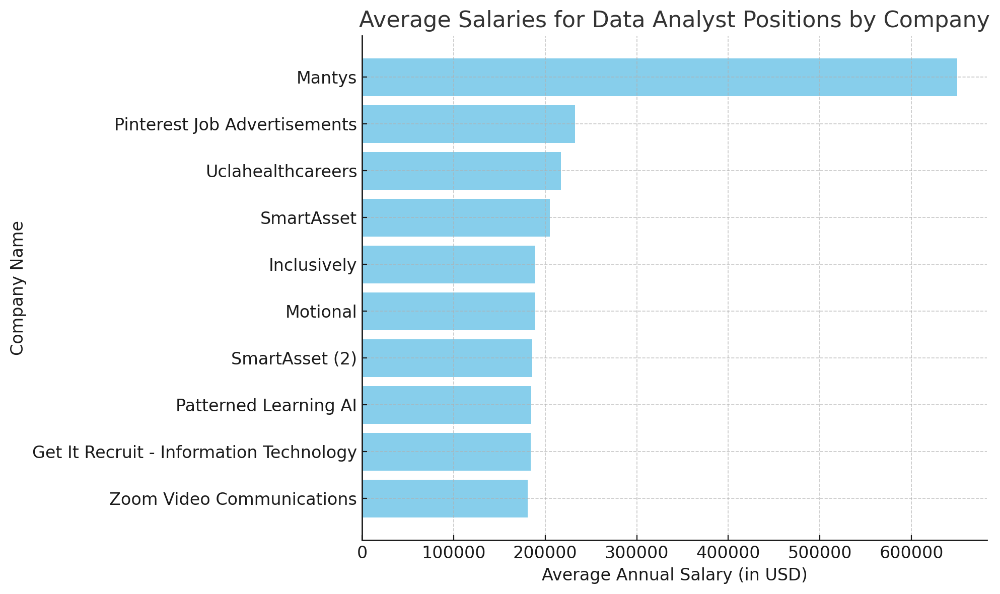
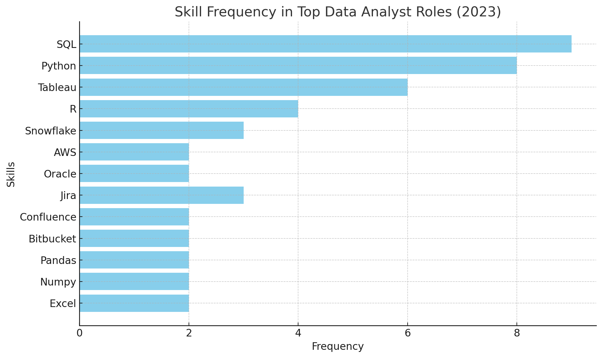
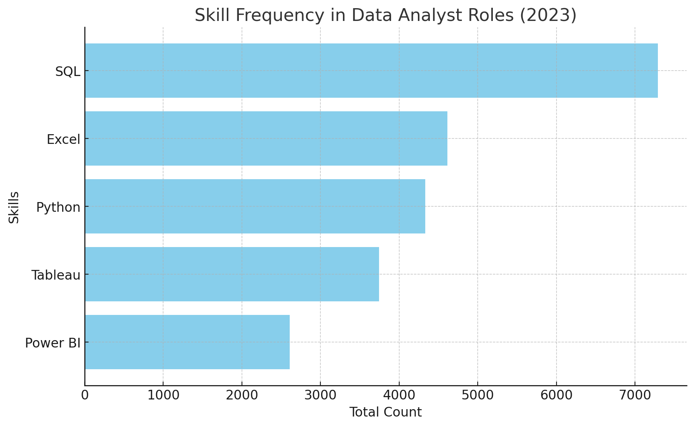
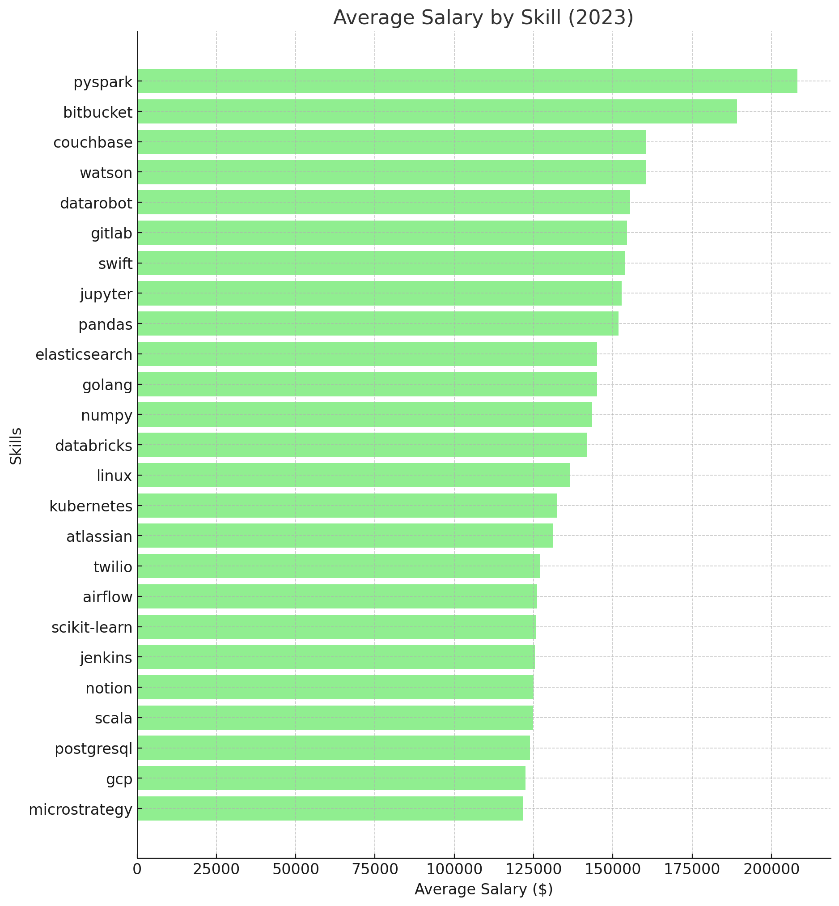
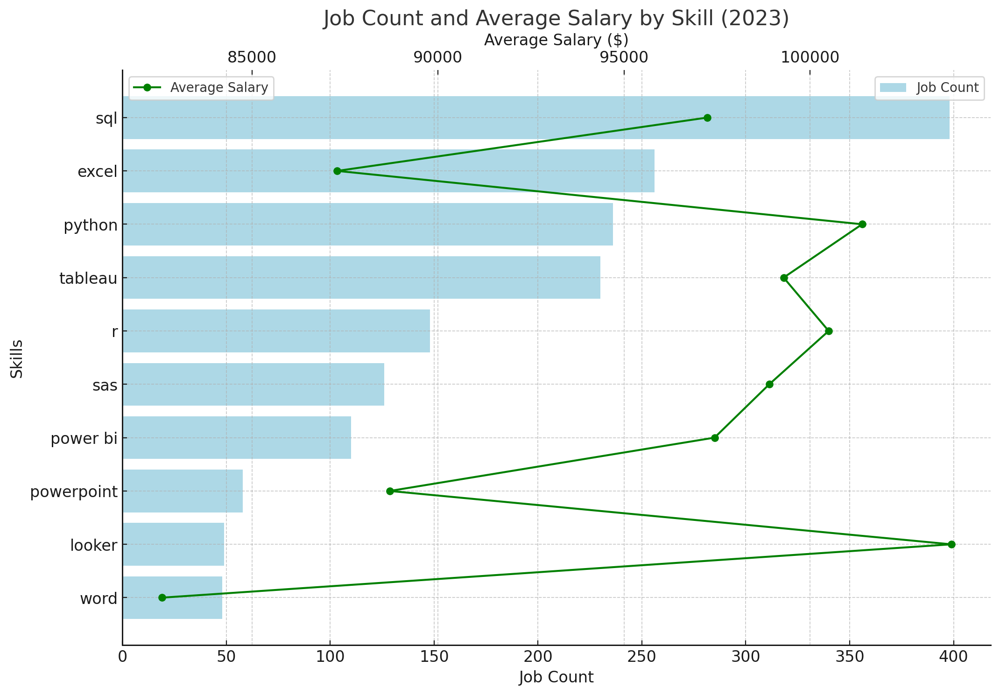

# Introduction 
📊 Dive into the data job market! Focusing on data
analyst roles, this project explores 💰 top-paying
jobs, 📈 in-demand skills, and ✅ where high 
demand meets high salary in data analytics.

SQL queries? Check them out here: 
[project_sql folder](/project_sql/) 
# Background
### The question I wanted to answer through my SQL queries were:
1. What are the top-paying data analyst jobs?
2. What skills are required for the top-paying data analyst jobs?
3. What skills are most in demand for data analysts?
4. What are the top high-paid skills ?
5. What are the most optimal skills to learn?
# Tools I Used
## Here are the programs I frequently used for data analysis:

### **SQL** (Structured Query Language):
- I used SQL to query and manipulate databases. This included tasks like filtering, joining, and aggregating data to extract meaningful insights. SQL allowed me to perform complex data retrievals, which were crucial for understanding patterns and trends in the datasets.

### **PostgreSQL** (Postgres):
- PostgreSQL served as my primary relational database management system (RDBMS) for storing and managing data. I used it to create and manage databases, ensuring data integrity and executing SQL queries efficiently. Its advanced features like indexing, transactions, and constraints supported robust data analysis.

### **VS Code** (Visual Studio Code):
- I used VS Code as my main code editor for writing and debugging SQL queries and scripts. Its extensions for SQL and Git integration helped streamline the development and version control process, making it easier to manage my workflow.

### **Git & GitHub**:
- Git and GitHub were used for version control and collaboration. I used Git to track changes in my scripts and data analysis projects, enabling me to revert to previous versions if needed. GitHub provided a platform to store my projects remotely, collaborate with others, and showcase my work.
# The Analysis
Each query for this project aimed at investigating specific aspects of the data analyst job market.
Here's how I approached each question: 
## 1. Top-Paying Data Analyst Jobs.
I identified top 10 high-paid data analyst roles, focusing on remote jobs, job schedule types, job posted date, company name and id. 

```sql
SELECT
    job_postings_fact.job_id,
    company_dim.name,
    job_postings_fact.job_title,
    job_postings_fact.job_location,
    job_postings_fact.job_schedule_type,
    job_postings_fact.salary_year_avg,
    job_postings_fact.job_posted_date
    
FROM 
    job_postings_fact
LEFT JOIN company_dim ON company_dim.company_id = job_postings_fact.company_id
where 
    job_title LIKE '%Data Analyst%'
    AND job_location = 'Anywhere'
    AND salary_year_avg IS NOT NULL

ORDER BY
    salary_year_avg DESC
LIMIT 10
```
## Key Observations:
### Salary Disparities:

The salaries range from $181,000 to $650,000 annually. The highest-paying role is the Data Analyst position at Mantys, with an impressive $650,000 salary, far outpacing the others.
Roles in established tech companies like Pinterest and healthcare institutions like UCLA are listed at more moderate salaries, ranging from $217,000 to $232,423.

### Job Titles and Specialization:

The listed job titles range from generic “Data Analyst” roles to more specialized titles like “Principal Data Analyst,” “Senior Data Analyst,” and “Director, Data Analyst.”
More specialized or senior roles (e.g., Principal, Senior, Director) tend to come with higher compensation, reflecting the value placed on experience and leadership within the data analytics field.

### Employment Patterns by Industry:

Tech and finance companies like Pinterest, SmartAsset, and Patterned Learning AI dominate the list, showing that these sectors are heavily investing in data talent.
The listing also includes healthcare (UCLA) and communications (Zoom), indicating that data analytics is a cross-industry requirement.


*The bar chart comparing the average salaries for data analyst positions by company.*

## 2. Skills are required for the top-paying data analyst jobs
I specified the required skills for the top 10 top-paying jobs, focusing on remote Data Analyst roles and average yearly salary.
 
 ```sql
WITH top_paying_jobs AS (
    SELECT
        job_postings_fact.job_id,
        company_dim.name,
        job_postings_fact.job_title,
        job_postings_fact.salary_year_avg
        
    FROM 
        job_postings_fact
    LEFT JOIN company_dim on company_dim.company_id = job_postings_fact.company_id
    where 
        job_title like '%Data Analyst%'
        and job_location = 'Anywhere'
        and salary_year_avg is not NULL

    ORDER BY
        salary_year_avg DESC
    LIMIT 10
)

SELECT 
    top_paying_jobs.*,
    skills_dim.skills
FROM top_paying_jobs
INNER JOIN skills_job_dim on top_paying_jobs.job_id = skills_job_dim.job_id
INNER JOIN skills_dim on skills_job_dim.skill_id = skills_dim.skill_id
ORDER BY
    salary_year_avg DESC
```
### The dataset highlights key trends in top-paying remote data analyst roles in 2023. Here’s a summary of the patterns:

### 1. Top Skills by Demand:
**SQL** : The most frequently mentioned skill across all roles, appearing in nearly all listings. It’s a fundamental requirement for data querying and analysis.

**Python**: A close second to SQL, it’s essential for data manipulation, analysis, and automation.

**Tableau**: A leading visualization tool, it shows up often, signaling its importance in reporting and data presentation.

**R**: Though less common than Python, it’s still in demand for statistical analysis and certain specialized data roles.

**Snowflake, AWS, and Oracle**: These cloud and database management tools indicate the growing need for data storage and processing knowledge.

### 2. Additional Technical Skills:
**Excel, Pandas, and Numpy** : These appear multiple times, reinforcing the importance of both foundational spreadsheet skills and specialized libraries for data manipulation.

**Tools for Collaboration and Project Management**: Jira, Confluence, and Bitbucket are often listed, pointing to a need for managing workflows and version control in team settings.

**Cloud Services** : AWS and Snowflake indicate a shift towards cloud-based data solutions.

### 3. Role-Specific Insights:
**Director and Principal Roles** : These higher-level roles include more advanced or specialized tools (like Jenkins, SAP, and Power BI), suggesting that those targeting senior positions need a broader skill set.

**Marketing and Hybrid Analyst Roles**: Skills like Crystal and Flow show up in more niche or specialized roles, indicating that industry-specific tools are important for certain positions.

### 4. Salary Observations:
Roles with a focus on Python, SQL, and cloud services tend to have the highest average salaries, demonstrating the value of proficiency in these areas.

### 5. Visualization:

*Here is a bar chart showing the frequency of key skills in the top data analyst roles for 2023. The chart highlights how SQL, Python, and Tableau dominate, with other skills like R, Snowflake, and Jira also being valuable additions.*

## 3. Skills are most in demand for data analysts.
I identified the most demanded skills for Data Analysts. I focused on the availability of working from home.

```sql
SELECT 
    skills,
    COUNT(job_postings_fact.job_id) AS total_count
FROM job_postings_fact
INNER JOIN 
    skills_job_dim ON job_postings_fact.job_id = skills_job_dim.job_id
INNER JOIN 
    skills_dim ON skills_job_dim.skill_id = skills_dim.skill_id
WHERE
    job_title_short = 'Data Analyst' AND job_work_from_home = TRUE
GROUP BY
    skills
ORDER BY
    total_count DESC
LIMIT 5;
```

- SQL is the most prevalent skill with a total count of 7,291.
- Excel follows with a total count of 4,611.
- Python is close behind Excel with a count of 4,330.
- Tableau has a total count of 3,745.
- Power BI has the lowest count among the listed skills, with 2,609.


*This suggests that SQL is a highly demanded skill, followed by Excel and Python, with Tableau and Power BI being slightly less common*.
## 4. Top-Paying skills.
I identified the 25 most lucrative skills for Data Analysts. I also focused on the availability of working from home.

```sql
SELECT
    skills,
    ROUND(AVG(salary_year_avg)) AS avg_salary
FROM job_postings_fact
INNER JOIN 
    skills_job_dim ON job_postings_fact.job_id = skills_job_dim.job_id
INNER JOIN 
    skills_dim ON skills_job_dim.skill_id = skills_dim.skill_id
WHERE
    job_title_short = 'Data Analyst'
    AND salary_year_avg IS NOT NULL
    AND job_work_from_home = TRUE
GROUP BY
    skills
ORDER BY
    avg_salary DESC
LIMIT 25
```
### Here are a few insights based on the top 25 high-paid skills for Data Analysts:

1. Data Engineering and Big Data Tools Dominate the Top Slots:
Skills like PySpark (Avg. Salary: $208,172) and Couchbase (Avg. Salary: $160,515) command high salaries. These tools are essential for large-scale data processing and distributed computing, making them highly valued.
 
2. Version Control and DevOps Tools are Highly Valued:
Bitbucket (Avg. Salary: $189,155), GitLab (Avg. Salary: $154,500), and Jenkins (Avg. Salary: $125,436) show how critical version control and CI/CD pipelines are in the data space. Data Analysts with DevOps skills can significantly impact projects by ensuring smooth deployment and integration.
 
3. AI and Machine Learning Tools Offer Competitive Salaries:
Tools like Watson (Avg. Salary: $160,515), DataRobot (Avg. Salary: $155,486), and scikit-learn (Avg. Salary: $125,781) reflect the growing demand for machine learning in analytics roles.
 
4. Data Science and Analytics Libraries Remain Critical:
Core libraries like Pandas (Avg. Salary: $151,821), Jupyter (Avg. Salary: $152,777), and Numpy (Avg. Salary: $143,513) continue to offer strong salary prospects. These tools form the backbone of data analysis, modeling, and exploratory data science.

5. Programming Languages Tailored for Data Engineering are Valued:
Golang (Avg. Salary: $145,000), Scala (Avg. Salary: $124,903), and Swift (Avg. Salary: $153,750) indicate that specialized programming languages associated with data pipelines and performance optimization lead to higher earnings.

6. Cloud Platforms are Important:
Google Cloud Platform (GCP) (Avg. Salary: $122,500) is highlighted, showing the importance of cloud infrastructure in analytics. Mastering cloud tools is becoming essential as data storage and processing increasingly move to cloud environments.

7. Visualization and Reporting Tools have Good Pay but are Lower on the List:
Tools like MicroStrategy (Avg. Salary: $121,619) are still well-paid but are lower on the list, showing that data engineering and machine learning skills tend to command higher salaries.

8. Open Source and Enterprise Collaboration Tools Have Growing Importance:
Notion (Avg. Salary: $125,000) and Atlassian (Avg. Salary: $131,162) show that data analysts are also expected to be familiar with collaboration tools that enhance productivity in team-based environments.


*In summary, the highest-paying roles focus heavily on data engineering, cloud platforms, and machine learning, with strong demand for both DevOps and core data science libraries. Data analysts looking to maximize their earning potential should consider specializing in these high-demand areas.*

## 5. Golden Mean
I tried to find golden mean between high salary skills and high demand skills to avoid high extremes and downsides. 

```sql
SELECT
    skills_dim.skills,
    ROUND(AVG(salary_year_avg)) AS avg_salary,
    COUNT(job_postings_fact.job_id) AS count
FROM
    job_postings_fact
INNER JOIN 
    skills_job_dim 
        ON job_postings_fact.job_id = skills_job_dim.job_id
INNER JOIN 
    skills_dim 
        ON skills_job_dim.skill_id = skills_dim.skill_id
WHERE
    job_title_short = 'Data Analyst'
    AND salary_year_avg IS NOT NULL
    AND job_work_from_home = TRUE
GROUP BY
    skills_dim.skills
HAVING 
    COUNT(job_postings_fact.job_id) > 10
ORDER BY
    COUNT(job_postings_fact.job_id) DESC,
    ROUND(AVG(salary_year_avg)) DESC
LIMIT 10
```

### Key Insights:

*The chart above shows the relationship between job count and average salary for various skills in 2023.*

1. High Demand & High Salary:

- SQL has the highest job count (398) and a solid average salary ($97,237), making it both in demand and relatively well-compensated.

- Python and Tableau are similarly strong, with decent job counts (236 and 230) and average salaries just over $100,000.

2. High Salary & Lower Demand:
- Looker stands out with the highest average salary ($103,795) but has one of the lowest job counts (49). This indicates a specialized skill with high pay but fewer available positions.
- R and SAS offer strong average salaries (around $100,000) with moderate demand, indicating their continued relevance in specific data roles.

3. Lower Salary & Lower Demand:
- Word and PowerPoint are on the lower end of both job count and average salary, highlighting that these general skills are less valued in specialized roles like data analysis.

**This chart helps identify which skills are most in demand and which offer the highest pay, guiding decisions on skill development.**

# What I Learned
This project enhanced my SQL skills and provided valuable insights into the data analyst job market. The findings from the analysis serve as a guide to prioritizing skill development and job search efforts. Aspiring data analysts can better position themselves in a competitive job market by focusing on high-demand, high-salary skills. This exploration highlights the importance of continuous learning and adaptation to emerging trends in the field of data analytics.

# Conclusions 
After extensive effort and determination, I successfully completed my first SQL project. 🖥️

It wasn't without its challenges—from losing my PostgreSQL password and struggling with program setups to debugging persistent code errors. Yet, despite these obstacles, I pushed through and brought the project to completion.
